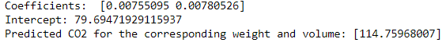

# Implementation of Multivariate Linear Regression
## Aim
To write a python program to implement multivariate linear regression and predict the output.
## Equipment’s required:
1.	Hardware – PCs
2.	Anaconda – Python 3.7 Installation / Moodle-Code Runner
## Algorithm:
### Step1: 
Import panda
<br>

### Step2:
Import linear model from sklearn
<br>

### Step3:
Read the file using read_csv.
<br>

### Step4:
Get the inputs from the user as x and y.
<br>

### Step5:
Use regr.fit(x,y) to et the output.

<br>

## Program:
```
# DEVELOPED BY:KRISHNA PRAKAASH D M
# REG NO: 212221230052

import pandas as pd
from sklearn import linear_model
df=pd.read_csv("cars.csv")
x=df[['Weight', 'Volume']]
y=df['CO2']
regr=linear_model.LinearRegression()
regr.fit(x,y)
print('Coefficients: ', regr.coef_)
print('Intercept:', regr.intercept_)
predictedCO2=regr.predict([[3300, 1300]])
print('Predicted CO2 for the corresponding weight and volume:',predictedCO2)

```
## Output:



## Result
Thus the multivariate linear regression is implemented and predicted the output using python program.